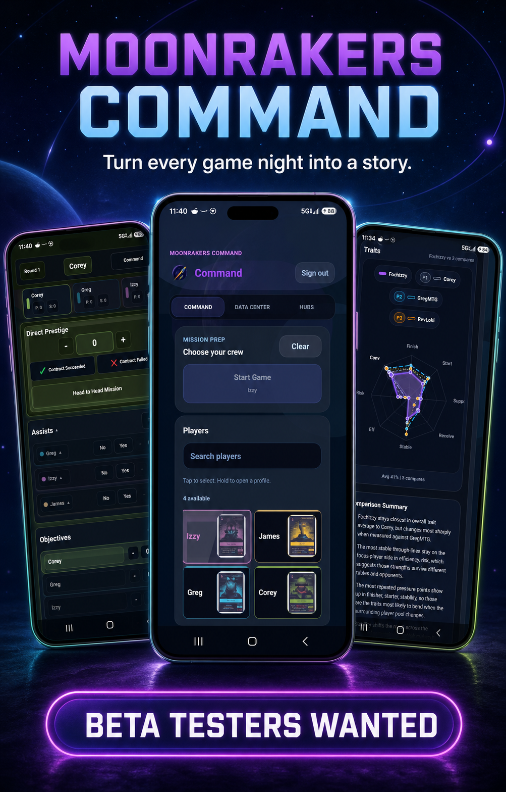
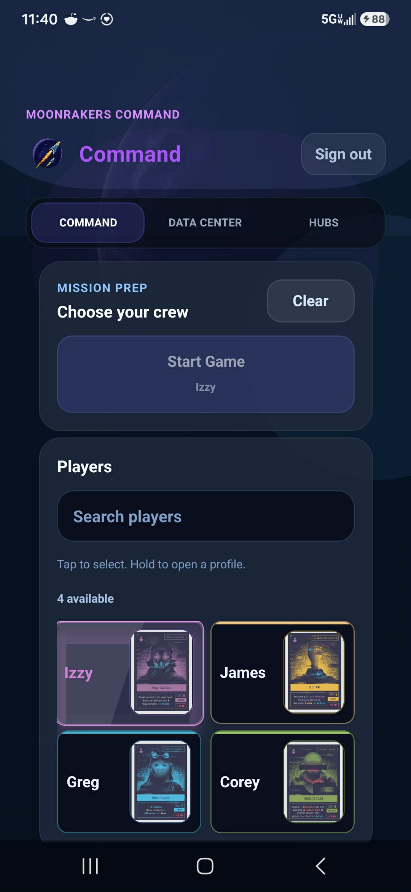
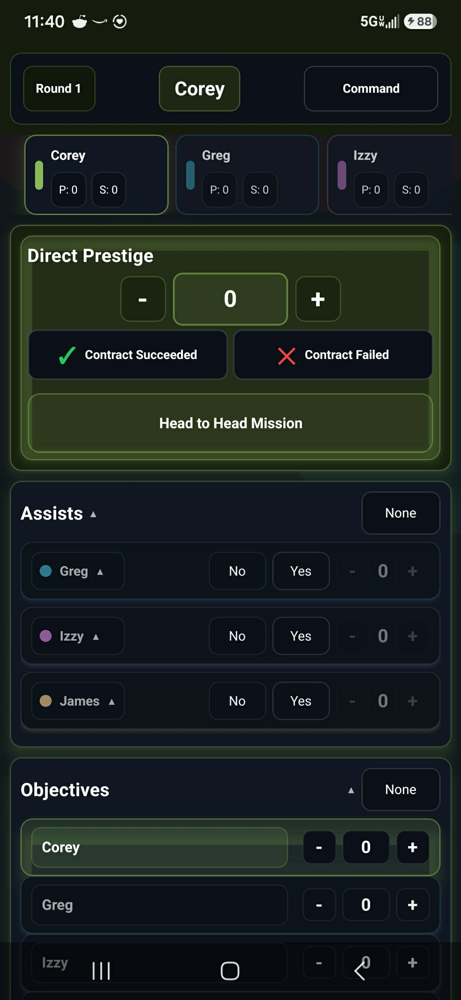
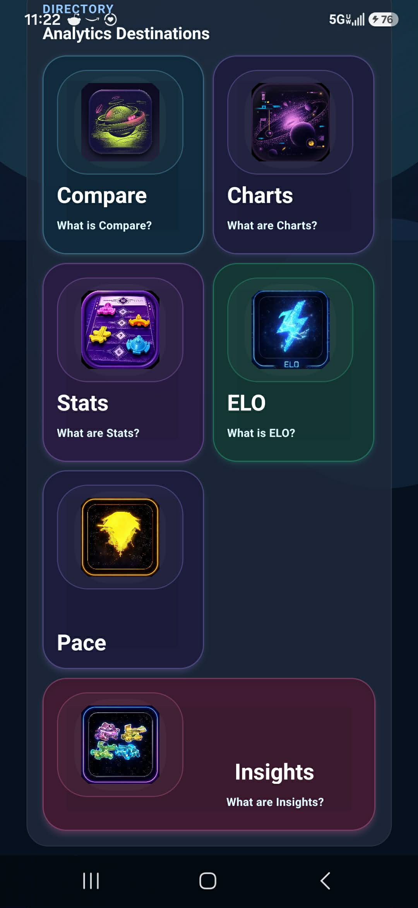

# Moonraker's Analytics



An end-to-end companion for recording Moonrakers games and turning a group's play history into useful, trustworthy analytics. The project includes an Expo/React Native Android application and an authenticated Next.js dashboard backed by Supabase.

## What it does

- **Tracks live games** — choose a crew, set turn order, record turns and outcomes, and save a structured game history.
- **Builds a player directory** — manage verified players and groups while keeping profile identity separate from game-derived statistics.
- **Explains performance** — explore ELO, leaderboards, head-to-head results, pace, trends, player profiles, and configurable charts.
- **Supports mobile and web** — the Android application handles play at the table; the dashboard provides a larger analytics workspace.
- **Protects shared data** — authentication, row-level security, verified player access, and server-authored analytics keep authorization and business logic close to the data.

## Product tour

| Build your crew | Track the game | Explore the analytics |
| --- | --- | --- |
|  |  |  |

## Architecture

| Layer | Technology |
| --- | --- |
| Mobile application | Expo, React Native, Expo Router, TypeScript, Zustand |
| Web dashboard | Next.js, React, Recharts, Zod |
| Data and identity | Supabase Auth, Postgres, row-level security, RPC functions |
| Hosting and releases | Cloudflare Workers via OpenNext, EAS Build, EAS Update, Google Play |
| Quality gates | TypeScript, ESLint, Node test suites, Vitest, Playwright, GitHub Actions |

The mobile and web clients share a Supabase-backed source of truth. Analytical meaning is authored by database functions and explicit contracts rather than recomputed differently on each screen. That boundary keeps rankings, comparisons, and access rules consistent across clients.

## Engineering approach

- Database migrations are versioned in `supabase/migrations/`.
- Public access is constrained through RLS and narrowly scoped functions.
- CI runs full-tree typechecking, focused linting, and 375+ automated guards.
- The dashboard has unit and end-to-end suites through Vitest and Playwright.
- Android releases use versioned EAS builds, store submission profiles, and runtime-scoped over-the-air updates.
- Design notes under `docs/superpowers/specs/` preserve the problem, constraints, decisions, and verification plan for significant changes.

## Development

```bash
npm install
npm start                 # Expo development server
npm run dashboard:dev     # Next.js dashboard
npm run verify            # Typecheck + application test suites
npm run dashboard:test    # Dashboard unit tests
npm run dashboard:e2e     # Dashboard end-to-end tests
```

Copy `.env.example` to `.env` and provide the documented Supabase values for local development. Deployment credentials and service-account keys must remain outside the repository.

## Deployment

The authenticated dashboard is deployed at [moonrakersapp.org](https://www.moonrakersapp.org). The Android application is built and distributed through EAS and Google Play.

This is an independently built, fan-made companion and is not affiliated with the publisher of Moonrakers.
